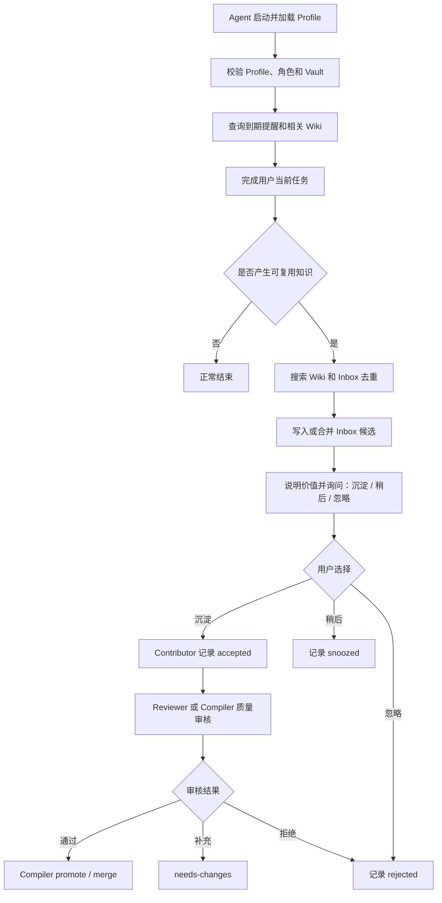

# AgentsKM Profile 配置与多 Agent 接入改造计划 v3

> 版本：v3.0-draft  
> 日期：2026-07-27  
> 状态：Setup 子流程已实现并通过自动化验收；其余阶段待逐项评审  
> 基线版本：AgentsKM Toolkit 0.2.0  
> 适用范围：Codex、Hermes、Claude Code、Cursor 及其他 CLI/MCP Agent  
> 本文定位：取代 `KM_PATH` 单一来源方案，作为下一轮配置、角色和插件接入改造的执行基线

## 1. 本轮目标

本轮将 AgentsKM 从“Vault 路径和角色分别由环境变量或启动参数决定”改造为：

```text
每个 Agent 独立安装插件或 MCP 包
             ↓
启动时选择一个 Agent Profile
             ↓
Profile 同时绑定 actor_id、role 和 vault
             ↓
所有 Profile 可引用同一个本地 Vault
             ↓
Inbox → 用户意向 → 质量审核 → Wiki 编译
```

目标结果：

1. 同一 Windows 用户下的多个 Agent 默认读取一份用户级配置。
2. 每个 Agent 只选择一个 Profile，不再分别配置 Vault 路径和角色。
3. Hermes 等日常 Agent 可以发现、提交候选并记录用户选择，但不能写 Wiki。
4. Codex 等可信 Agent 可以审核并编译已获用户授权的候选。
5. Reviewer 是可选的独立权限，不要求个人知识库常驻一个 Reviewer Agent。
6. 插件安装后不依赖共享 Toolkit 开发目录。
7. 用户只有在获取已有 Vault 内容时才需要克隆 Vault；不需要克隆 Toolkit。
8. 配置错误必须失败关闭，不得把 Toolkit、插件缓存或当前目录误当成 Vault。

## 2. 已确定原则与待评审决策

### 2.1 本计划采用的推荐原则

| 编号 | 原则 | 计划结论 |
|---|---|---|
| P-01 | Profile 含义 | Profile 是 Agent 运行身份，不是单纯的 Vault 别名 |
| P-02 | Vault 复用 | `vaults` 单独定义；多个 Profile 可以引用同一个 Vault |
| P-03 | 角色绑定 | `role` 只在 Profile 中定义，运行时不再单独传入 |
| P-04 | 默认权限 | 未显式选择 Profile 时只能使用 `default/contributor` |
| P-05 | Reviewer 定位 | 共享的是审核队列，不共享 Reviewer 身份或凭据 |
| P-06 | 个人模式 | Codex 使用 `compiler`，并可同时执行 Reviewer 能力 |
| P-07 | 插件部署 | 插件由每个 Agent 宿主独立安装；运行时不要求共享插件目录 |
| P-08 | 仓库克隆 | Toolkit 不需手动克隆；Vault 仅在获取既有内容或 Git 同步时克隆 |
| P-09 | 安全边界 | MCP 角色是工作流权限，不是操作系统安全沙箱 |
| P-10 | 配置职责 | 用户配置只保存机器/Agent 差异；不可绕过的规则保留在 CLI 和协议中 |

### 2.2 需要用户逐项确认的决策门

这些决策在评审通过前保持 `待确认`，实施阶段不得擅自改变。

| 决策门 | 待确认内容 | 推荐值 | 状态 |
|---|---|---|---|
| D-01 | Profile 是否作为唯一运行身份入口 | 是 | 待确认 |
| D-02 | 用户级配置默认位置 | `%USERPROFILE%\.agentskm\config.json` | 待确认 |
| D-03 | 正式环境是否只保留 `AGENTSKM_CONFIG`、`AGENTSKM_PROFILE` | 是 | 待确认 |
| D-04 | 是否废弃 `KM_PATH`、`AGENTSKM_DATA_ROOT`、`AGENTSKM_ROLE` 和 `--role` | 一个版本警告后移除 | 待确认 |
| D-05 | Contributor 是否可记录用户三选一，但不能做质量批准 | 是，新增用户意向层 | 待确认 |
| D-06 | 个人模式是否允许 Compiler 兼任 Reviewer | 是 | 待确认 |
| D-07 | 是否默认关闭职责分离 | `separation_of_duties=false` | 待确认 |
| D-08 | Codex 插件默认选择的 Profile 名 | `codex` | 待确认 |
| D-09 | 未知 Profile 的处理 | 明确报错，不回退 | 待确认 |
| D-10 | MCP 是否只检查和指导 Setup，配置仅由本地 CLI 写入 | 是 | 已确认并实现（2026-07-27） |

## 3. 当前实现基线与差距

当前 0.2.0 已具备候选、审核、提醒、毕业、合并、锁、事务、审计和 MCP 工具分级。需要改造的是配置与身份边界。

| 范围 | 当前行为 | 目标行为 | 主要位置 |
|---|---|---|---|
| Vault 解析 | `AGENTSKM_DATA_ROOT` → 用户配置 → Toolkit 根目录 | Profile → Vault；缺失即失败 | `tools/km-cli/km.py` |
| 用户配置 | 只保存一个 `vault` 字符串 | 保存 `vaults`、`profiles` 和少量用户策略 | `tools/km-cli/km.py` |
| CLI 角色 | `--actor-role` 或 `AGENTSKM_ROLE` | 从选中 Profile 推导 | `tools/km-cli/km.py` |
| MCP 角色 | `--role` 或 `AGENTSKM_ROLE` | `--profile` 或 `AGENTSKM_PROFILE` | `adapters/mcp/km_mcp.py` |
| Codex 插件 | `.mcp.json` 固定 `compiler` | `.mcp.json` 选择 `codex` Profile | `plugins/agentskm-toolkit/.mcp.json` |
| 非 Codex 生成器 | 接收 `--vault` 和 `--role` | 只接收 `--profile`，可选 `--config` | `scripts/render_mcp_config.py` |
| 配置工具 | MCP 暴露 `km_configure_vault` | MCP 不修改用户级全局配置 | MCP adapter |
| 用户选择 | `review` 整体要求 Reviewer | Contributor 可记录意向；Reviewer 才能质量批准 | CLI、MCP、候选状态机 |
| 插件运行副本 | 主源码构建复制到插件 | 保持该机制并增加配置模块/schema 同步 | `scripts/build_plugin.py` |
| 接入文档 | 要求克隆两个仓库、设置 `KM_PATH` | 安装插件、准备 Vault、配置 Profile | `docs/`、README、Skill |

## 4. 目标配置模型

### 4.1 配置文件位置

默认位置：

```text
%USERPROFILE%\.agentskm\config.json
```

可通过下面的环境变量选择另一份配置文件：

```text
AGENTSKM_CONFIG=C:\path\to\another-config.json
```

`config.json` 是机器本地配置，不提交到 Toolkit 或 Vault 仓库。不同机器可以使用不同绝对路径，但仍指向各自同步得到的同一逻辑 Vault。

### 4.2 v1 目标配置示例

```json
{
  "schema_version": 1,
  "default_profile": "default",
  "vaults": {
    "main": {
      "path": "D:\\Knowledge\\agentskm-vault",
      "create_if_missing": false
    }
  },
  "profiles": {
    "default": {
      "display_name": "Unknown local agent",
      "host": "unknown",
      "actor_id": "local-default",
      "role": "contributor",
      "vault": "main",
      "enabled": true
    },
    "hermes-agent": {
      "display_name": "Hermes Agent",
      "host": "hermes",
      "actor_id": "hermes-agent",
      "role": "contributor",
      "vault": "main",
      "enabled": true
    },
    "codex": {
      "display_name": "Codex",
      "host": "codex",
      "actor_id": "codex",
      "role": "compiler",
      "vault": "main",
      "enabled": true
    },
    "km-reviewer": {
      "display_name": "Knowledge Reviewer",
      "host": "generic",
      "actor_id": "km-reviewer",
      "role": "reviewer",
      "vault": "main",
      "enabled": false
    }
  },
  "policies": {
    "review": {
      "separation_of_duties": false
    },
    "reminders": {
      "enabled": true,
      "default_snooze_days": 7
    }
  }
}
```

### 4.3 字段约束

| 字段 | 必填 | 约束 |
|---|---|---|
| `schema_version` | 是 | v1 必须为整数 `1`；未知版本拒绝加载 |
| `default_profile` | 是 | 必须引用已启用 Profile，且建议为 `contributor` |
| `vaults` | 是 | 至少一个命名 Vault |
| `vaults.*.path` | 是 | 本机绝对路径；解析后必须是合法 Vault |
| `create_if_missing` | 否 | 默认 `false`；只有显式初始化命令可以创建 Vault |
| `profiles` | 是 | 至少包含 `default` |
| `profiles.*.host` | 是 | 宿主类型，仅用于识别和审计，不作为安全凭证 |
| `profiles.*.actor_id` | 是 | 同一配置内唯一、稳定、非空 |
| `profiles.*.role` | 是 | 仅允许 `contributor/reviewer/compiler` |
| `profiles.*.vault` | 是 | 必须引用 `vaults` 中已定义项 |
| `profiles.*.enabled` | 否 | 默认 `true`；禁用后不得启动 |
| `separation_of_duties` | 否 | 默认 `false`；为 `true` 时 Reviewer 与 Compiler 的 `actor_id` 必须不同 |
| `default_snooze_days` | 否 | 正整数，建议范围 1–365，默认 7 |

### 4.4 不应进入配置文件的内容

以下内容必须留在代码、协议或安全存储中：

- 每种角色的工具能力表，避免用户通过编辑 JSON 自定义提权。
- “Wiki 只能由 Compiler 写入”等不可绕过的核心规则。
- Git Token、API Key、HTTP Token、账号密码。
- 插件缓存路径或 Toolkit 开发目录。
- 运行时锁、事务状态和当前会话状态。
- 对话全文和候选知识正文。

## 5. Profile 解析与失败规则

### 5.1 Profile 选择顺序

```text
MCP/CLI 的 --profile
        ↓ 未提供
AGENTSKM_PROFILE
        ↓ 未提供
config.json.default_profile
        ↓
profiles[profile].vault
        ↓
vaults[vault].path
```

`--profile` 主要供宿主注册配置使用；日常 Agent 不应在对话中自行更换。

### 5.2 必须失败关闭的情况

- 配置文件不存在或 JSON 损坏。
- `schema_version` 不支持。
- 显式指定的 Profile 不存在或被禁用。
- Profile 引用不存在的 Vault。
- Vault 路径不存在、不是绝对路径或不符合 AgentsKM 结构。
- Profile 角色未知。
- `actor_id` 重复。
- 开启职责分离后，同一 actor 同时执行审核和编译。

失败时不得：

- 回退到 Toolkit 根目录。
- 回退到插件安装缓存。
- 回退到当前工作目录。
- 把未知 Profile 静默改为 `compiler`。
- 自动创建一个可能位置错误的新 Vault。

### 5.3 环境变量收敛

正式目标只保留：

| 环境变量 | 用途 |
|---|---|
| `AGENTSKM_CONFIG` | 可选，覆盖用户配置文件位置 |
| `AGENTSKM_PROFILE` | 可选，选择当前 Agent Profile |

计划废弃：

```text
KM_PATH
AGENTSKM_DATA_ROOT
AGENTSKM_ROLE
--role
--actor-role
```

废弃项只用于兼容迁移，不得与新配置同时决定最终权限。检测到新旧配置同时存在时输出明确警告，并以 Profile 为准。

## 6. Reviewer 与用户意向层

### 6.1 三种 Agent 角色

| 角色 | 可执行动作 | 不可执行动作 |
|---|---|---|
| Contributor | 查询、创建候选、提醒、记录用户三选一 | 质量批准、写 Wiki、合并 Wiki |
| Reviewer | Contributor 能力、去重分类、补证据、质量批准 | 写 Wiki、合并 Wiki |
| Compiler | Reviewer 能力、晋升和合并已满足条件的候选 | 绕过用户授权、扩大批准范围 |

角色仍按 `contributor < reviewer < compiler` 形成能力包含关系。角色能力写死在 CLI 中，不从配置动态加载。

### 6.2 用户决定与质量审核必须分开

当前 `review` 同时承担用户选择和审核状态，导致 Contributor 在用户回复后无法完成交互。目标状态拆分为：

```text
用户意向：capture / snooze / reject
质量审核：approve / needs-changes / reject
编译动作：promote / merge
```

建议新增 `km respond`，允许 Contributor 记录用户选择：

| 用户选择 | 候选状态 | 后续 |
|---|---|---|
| 沉淀 | `accepted` | 等待 Reviewer/Compiler 质量审核 |
| 稍后 | `snoozed` | 到期后再次提醒 |
| 忽略 | `rejected` | 保留审计，不再提醒 |

Reviewer 的 `approve` 表示候选质量和结构符合入库条件，不代替用户授权。Compiler 只能处理同时满足以下条件的候选：

1. 用户意向是 `capture`。
2. 质量审核状态是 `approved`。
3. 来源、敏感信息和目标路径校验通过。
4. 晋升范围不超过用户授权的候选范围。

候选需要分别记录：

```yaml
user_decision: capture
user_decided_at: 2026-07-27T12:00:00+08:00
user_decision_source: conversation:task-id
review_status: approved
reviewed_by_actor: codex
reviewed_at: 2026-07-27T12:05:00+08:00
```

### 6.3 Reviewer 的部署方式

默认个人模式：

```text
hermes-agent = contributor
codex        = compiler（包含 Reviewer 能力）
km-reviewer  = disabled
```

此模式下 Hermes 可以记录“沉淀”请求，Codex 下一次活动时完成质量审核和编译，不需要用户重复批准同一候选。

严格模式：

```text
hermes-agent = contributor
km-reviewer  = reviewer
codex        = compiler
separation_of_duties = true
```

此时审核和编译必须由不同 `actor_id` 完成。所谓“公共 Reviewer”只能理解为一个专用审核服务读取公共 Inbox，不能把 Reviewer Profile 当成所有 Agent 共用的身份。

## 7. CLI 与配置管理改造

### 7.1 建议的配置命令

```text
km config init
km config validate
km config show
km config effective --profile codex
km vault add <name> --path <absolute-path>
km vault list
km profile add <name> --host <host> --actor-id <id> --role <role> --vault <vault>
km profile list
km profile show <name>
km profile enable|disable <name>
km profile set-default <name>
```

配置修改使用临时文件加原子替换；写入前校验，失败时保留原配置。`config show/effective` 输出不得包含秘密，并应显示：

```json
{
  "config_path": "C:\\Users\\<username>\\.agentskm\\config.json",
  "profile": "codex",
  "actor_id": "codex",
  "role": "compiler",
  "vault_name": "main",
  "vault_path": "D:\\...\\agentskm-vault"
}
```

### 7.2 CLI 权限解析

所有 CLI 子命令启动时只解析一次 Effective Profile，并将其作为不可变运行上下文：

```text
RuntimeContext
  config_path
  profile_name
  actor_id
  host
  role
  vault_name
  vault_path
```

写命令直接从 `RuntimeContext.role` 做二次权限检查，不再信任 MCP 传入的 `--actor-role`。

### 7.3 配置变更不通过 MCP

从 MCP 工具列表移除 `km_configure_vault`。原因：

- 它修改所有本地 Agent 共享的用户级配置。
- Contributor 不应在正常对话中改变其他 Agent 的 Vault。
- 配置属于安装和运维动作，应由用户在本地 CLI 明确执行。

Agent 可以调用只读的 `km_config_status` 或 `km_status`，但不能通过 MCP 修改 Profile、角色或 Vault。

## 8. MCP、HTTP 与插件改造

### 8.1 MCP

目标启动方式：

```powershell
python adapters\mcp\km_mcp.py --profile codex
```

MCP 启动时：

1. 加载 Effective Profile。
2. 根据 Profile 角色生成工具列表。
3. 调用 CLI 时传递同一 Profile，而不是单独传角色。
4. 在 `initialize` 或状态工具中暴露非敏感身份摘要。
5. Profile 或 Vault 校验失败时停止启动，不提供空壳工具集。

### 8.2 HTTP

HTTP adapter 同样从 `--role` 迁移到 `--profile`。HTTP Token 仍来自独立安全环境变量，不写入 `config.json`。一个 HTTP 服务进程只绑定一个 Profile，避免请求方在参数中选择高权限身份。

### 8.3 Codex 插件

Codex 插件保持自包含：Skill、MCP 和 CLI 都在插件安装缓存内。目标 `.mcp.json` 使用：

```json
{
  "mcpServers": {
    "agentskm": {
      "command": "python",
      "args": [
        "./adapters/mcp/km_mcp.py",
        "--profile",
        "codex"
      ]
    }
  }
}
```

安装前提是用户配置中存在并启用了 `codex` Profile。缺少时应提示运行初始化命令，不应自动获得 Compiler 权限。

### 8.4 其他 Agent

配置生成器改为：

```powershell
python scripts\render_mcp_config.py `
  --agent hermes `
  --profile hermes-agent `
  --output <host-mcp-config>
```

生成器不再接收 Vault 和角色。它只负责：

- 校验 Profile 存在。
- 生成宿主所需 MCP 配置。
- 指向已安装的自包含包或稳定的可执行入口。
- 不要求用户保留 Toolkit 源码仓库。

## 9. 新 Agent 的标准接入流程

### 9.1 全新空知识库

```text
安装 AgentsKM 插件/包
  → km config init
  → km vault add main --path <本地目录>
  → 初始化空 Vault
  → km profile add <agent-profile> ...
  → 在宿主 MCP 中选择 Profile
  → 重启宿主并新建会话
  → status/search/permission probe
```

不需要克隆 Toolkit，也不需要克隆 Vault。

### 9.2 接入已有知识库

```text
安装 AgentsKM 插件/包
  → 从 Git 克隆 Vault，或从备份/同步盘恢复 Vault
  → km vault add main --path <已有 Vault>
  → 创建 Agent Profile
  → 注册 MCP
  → 重启并验收
```

只在获取已有知识内容时克隆 Vault。插件包由宿主安装机制获取，终端用户不克隆 Toolkit。

### 9.3 日常会话



## 10. 分阶段执行计划

### Phase 0：决策冻结与 ADR

任务：

- [ ] 用户逐项确认 D-01 至 D-10。
- [ ] 为 Profile 模型、Reviewer 模式、环境变量收敛分别建立 ADR。
- [ ] 明确兼容期长度和下一版本号。
- [ ] 冻结 config v1 字段与候选状态机变更。

退出条件：所有决策门有明确结论；本文状态改为“已批准实施”。

认证证据：ADR 文件、评审记录、最终配置样例。

### Phase 1：配置内核

任务：

- [ ] 从 `km.py` 抽出独立配置加载与验证模块。
- [ ] 实现 `Config`、`VaultConfig`、`AgentProfile`、`RuntimeContext` 数据结构。
- [ ] 实现 `AGENTSKM_CONFIG` 和 `AGENTSKM_PROFILE` 解析。
- [ ] 实现 Profile、Vault、角色和路径交叉校验。
- [ ] 删除 Toolkit 根目录兜底。
- [ ] 实现配置原子写入。
- [ ] 增加 `config/vault/profile` 管理命令。
- [ ] 提供机器可读的 `config effective --json`。
- [ ] 提供 config v1 JSON Schema 或等价的确定性验证器。

退出条件：错误配置全部失败关闭；两个 Profile 能从同一配置解析到同一 Vault 和不同角色。

认证证据：单元测试结果、错误场景输出、Effective Profile JSON。

### Phase 2：CLI 身份和权限

任务：

- [ ] 所有 CLI 命令改用单一 `RuntimeContext`。
- [x] 删除内部对 `AGENTSKM_ROLE` 和自由 `--actor-role` 的依赖。
- [ ] 所有审计写入 Profile 名和 `actor_id`。
- [ ] 实现 Contributor/Reviewer/Compiler 固定能力矩阵。
- [ ] 增加 `km respond`，拆分用户意向与质量审核。
- [ ] 更新候选 frontmatter 和状态迁移。
- [ ] 实现 `separation_of_duties` 检查。
- [ ] 保证 Promote/Merge 同时校验用户意向、审核状态和 Compiler 角色。

退出条件：Hermes Profile 能记录三选一但不能审核或晋升；Codex Profile 能在用户授权范围内完成闭环。

认证证据：角色负向测试、候选状态样例、审计日志样例。

### Phase 3：MCP 与 HTTP 适配器

任务：

- [ ] MCP 从 `--role` 改为 `--profile`。
- [ ] MCP 工具可见性从 Effective Profile 推导。
- [ ] MCP 调用 CLI 时保持同一 Profile。
- [ ] 从 MCP 移除 `km_configure_vault`。
- [ ] 为用户三选一增加结构化 MCP 工具。
- [ ] HTTP adapter 改为一个进程固定一个 Profile。
- [ ] MCP/HTTP 状态输出包含非敏感身份摘要。
- [ ] Profile 无效时适配器启动失败。

退出条件：工具列表和 CLI 二次校验一致；适配器无法通过请求参数临时提权。

认证证据：三角色 `tools/list` 快照、越权调用结果、无效 Profile 启动结果。

### Phase 4：插件、自包含构建和其他宿主

任务：

- [ ] Codex `.mcp.json` 从 `--role compiler` 改为 `--profile codex`。
- [ ] 更新 `render_mcp_config.py`，移除 `--vault`、`--role`。
- [ ] 扩展 `build_plugin.py`，同步配置模块和 schema。
- [ ] 确认安装缓存不引用 Toolkit 开发目录。
- [ ] 更新 Skill，明确 Profile、角色、三选一和跨 Agent 交接规则。
- [ ] 为 Hermes、Claude Code、Cursor 给出 Profile 注册样例。
- [ ] 定义远程插件/包发布入口，替代本地 Marketplace 路径。

退出条件：删除 Toolkit 源码目录后，已安装插件仍能访问配置和 Vault；其他宿主不需克隆 Toolkit 即可运行。

认证证据：插件内容清单、路径扫描、删除开发副本后的冒烟测试。

### Phase 5：兼容迁移

任务：

- [ ] 检测旧版 `{ "vault": "..." }` 配置并生成迁移预览。
- [ ] 提供一次性 `km config migrate`。
- [ ] 将旧 Vault 转成 `vaults.main`。
- [ ] 生成安全的 `default/contributor`，不自动生成 Compiler。
- [ ] 由用户明确创建 `codex/compiler` Profile。
- [ ] 旧环境变量和参数在兼容期输出废弃警告。
- [ ] 新旧配置同时出现时以 Profile 为准并报告冲突来源。
- [ ] 兼容期结束后移除旧解析路径。

退出条件：旧配置可无损迁移；迁移不会静默扩大任何 Agent 权限。

认证证据：迁移前后配置 diff、旧版回归测试、警告输出。

### Phase 6：文档与运维

任务：

- [ ] 重写新 Agent 接入文档，删除“必须克隆两个仓库”。
- [ ] 重写 Operations Runbook，使用 Profile 命令。
- [ ] 更新 Agent Knowledge Protocol，加入用户意向层。
- [ ] 更新 Toolkit、CLI、MCP 和插件 README。
- [ ] 标记旧 `KM_PATH` 文档为“已废弃方案”，避免并行指导。
- [ ] 增加多 Vault、多 Profile、换机和插件升级排障章节。
- [ ] 明确 MCP 权限不能替代 OS 文件权限。

退出条件：所有公开示例只使用 Profile 模型；全文搜索无未标注的旧配置指导。

认证证据：文档链接检查、关键字扫描结果、按文档完成的盲测记录。

### Phase 7：干净环境端到端验收

至少建立以下隔离 Profile：

```text
default       contributor
hermes-agent  contributor
codex         compiler
km-reviewer   reviewer（严格模式测试时启用）
```

验收场景：

- [ ] 未安装 Toolkit 源码，只安装发布插件/包。
- [ ] 新建空 Vault 并完成首次配置。
- [ ] 使用已有 Vault 完成接入。
- [ ] Hermes 和 Codex 访问同一 Vault。
- [ ] Hermes 创建候选并记录沉淀、稍后、忽略。
- [ ] Hermes 无法质量批准或写 Wiki。
- [ ] Codex 审核并晋升已接受候选。
- [ ] Codex 不能晋升未获用户授权的候选。
- [ ] 严格模式阻止同一 actor 审核后自行编译。
- [ ] 未知、禁用、损坏 Profile 全部失败。
- [ ] 两个 Agent 并发提交相同主题时保持幂等。
- [ ] 插件升级后，新会话加载新 Skill/MCP；旧会话有明确重启提示。
- [ ] Git 冲突时停止写入，不自动覆盖远端内容。

退出条件：所有必选场景通过，正式 Vault 未被测试写入。

认证证据：测试报告、临时 Vault diff、MCP 工具快照、日志和屏幕/终端记录。

### Phase 8：发布与切换

任务：

- [ ] 提升插件版本并生成 changelog。
- [ ] 发布 Toolkit 插件/包到 GitHub 来源。
- [ ] 先在测试 Vault 灰度。
- [ ] 备份正式用户配置和 Vault。
- [ ] 将正式 Codex 切换到 `codex` Profile。
- [ ] 将 Hermes 切换到 `hermes-agent` Profile。
- [ ] 观察至少一个完整“发现 → 三选一 → 审核 → 编译”周期。
- [ ] 删除不再使用的本地 Marketplace 绑定。
- [ ] 兼容期结束后清理旧环境变量。

退出条件：正式环境稳定完成闭环，且不存在 Toolkit 开发路径依赖。

认证证据：发布版本、安装来源、正式环境只读状态报告、首个闭环审计记录。

### Setup 子流程实施记录（2026-07-27）

状态：`已验证，待用户认证`。

本次已实现：

- Profile v1 配置加载、字段校验和 Effective Runtime 解析。
- `km setup-status` 只读检查。
- `km setup` 幂等写入、配置锁、原子替换和冲突拒绝。
- 旧 `{ "vault": "..." }` 配置自动迁移，并先保存 `.v0.bak`。
- 新建 Compiler Profile 必须显式传入 `--confirm-compiler`。
- MCP 缺少配置、Profile 或有效 Vault 时进入只读 Bootstrap 模式。
- Bootstrap 模式只暴露 `km_setup_status` 和 `km_setup_instructions`。
- MCP 不再暴露 `km_configure_vault`，也不能写用户配置。
- Setup 完成后要求重启 Agent 或重新连接 MCP。
- Codex 插件使用 Profile 启动；其他 Agent 配置生成器使用 `--profile`。
- Skill 能识别 Bootstrap 状态、展示变更并在用户确认后调用唯一 CLI 写入口。
- 插件自包含构建同步 `km.py`、`km_config.py`、MCP 和 README。

自动化证据：

```powershell
python -m py_compile tools\km-cli\km_config.py tools\km-cli\km.py adapters\mcp\km_mcp.py scripts\render_mcp_config.py tests\acceptance\test_km_workflow.py
python scripts\build_plugin.py --check
python tests\acceptance\test_km_workflow.py
```

已覆盖配置缺失、Bootstrap 工具列表、Hermes Contributor、Codex Compiler
显式确认、重复 Setup、旧配置迁移备份、三角色工具可见性、第二 Agent 配置
生成和插件自包含运行。

本次未实现，继续留在后续 Phase：

- Contributor 用户意向层和 `km respond`。
- HTTP adapter 的 Profile 化。
- 完整 `config/vault/profile` CRUD 命令集。
- 旧角色参数和环境变量的最终删除。
- 远程插件发布和真实 Hermes 宿主安装验收。

## 11. 测试矩阵

### 11.1 配置测试

| 场景 | 预期结果 |
|---|---|
| 默认配置 + 无 Profile 参数 | 使用 `default/contributor` |
| `AGENTSKM_PROFILE=codex` | 使用 `codex/compiler` |
| `--profile hermes-agent` | 使用 `hermes-agent/contributor` |
| 显式未知 Profile | 启动失败 |
| Profile 被禁用 | 启动失败 |
| Profile 引用未知 Vault | 校验失败 |
| Vault 路径不存在 | 明确失败，不创建目录 |
| 配置 JSON 损坏 | 明确显示配置文件路径和解析错误 |
| 两个 Profile 引用 main | 解析到同一规范化 Vault 路径 |
| 旧环境变量与 Profile 冲突 | Profile 生效并输出兼容警告 |

### 11.2 权限测试

| 操作 | Contributor | Reviewer | Compiler |
|---|---:|---:|---:|
| search/status/reminders | 允许 | 允许 | 允许 |
| propose | 允许 | 允许 | 允许 |
| respond capture/snooze/reject | 允许 | 允许 | 允许 |
| quality approve/needs-changes | 拒绝 | 允许 | 允许 |
| dashboard | 拒绝或只读 | 允许 | 允许 |
| promote/merge | 拒绝 | 拒绝 | 允许 |
| 修改用户配置 | MCP 一律拒绝 | MCP 一律拒绝 | MCP 一律拒绝 |

### 11.3 晋升前置条件测试

Compiler 在以下任一情况必须拒绝：

- 用户没有选择“沉淀”。
- 候选仍为 snoozed 或 rejected。
- 质量审核未通过。
- `source_refs` 缺失。
- `sensitivity=secret`。
- 目标路径位于 `wiki/` 之外。
- 开启职责分离且 Reviewer 与 Compiler 是同一 actor。
- Vault 锁无法获得或存在未恢复事务。

## 12. 风险登记与处理

| 风险 | 影响 | 处理方式 | 验收点 |
|---|---|---|---|
| 静态插件配置固定高权限 | 所有 Codex 默认成为 Compiler | 缺少 `codex` Profile 时失败；安装时显式创建 | 未配置时插件不能写 |
| Agent 自行切换 Profile | 工作流权限被绕过 | 宿主固定启动参数；MCP 不暴露切换工具 | 工具调用不能换 Profile |
| Shell 可直接改 Vault | MCP 权限被绕过 | 文档声明边界；高风险 Agent 使用 ACL/隔离账户 | 安全说明和隔离方案 |
| 多 Agent 写同一 Vault | 文件冲突或状态丢失 | 保留锁、事务、指纹幂等 | 并发测试 |
| Git 多机器同步冲突 | 本地锁无法覆盖远端 | 冲突时停止，由 Compiler/用户处理 | 冲突演练 |
| 配置文件单点损坏 | 所有 Agent 无法访问 | 原子写入、校验、`.bak` 恢复 | 损坏恢复测试 |
| 多个 Vault 误写 | 知识进入错误库 | Effective Profile 可见；写操作审计 Vault 名 | 双 Vault 负向测试 |
| 旧环境变量残留 | 不同 Agent 指向不同目录 | 兼容警告、Profile 优先、最终移除 | 环境冲突测试 |
| Reviewer 形同虚设 | Compiler 自审降低治理价值 | 个人/严格模式显式配置 | 两种模式分别验收 |
| Contributor 无法完成三选一 | 用户决定丢失 | 新增 `respond` 和用户意向字段 | Hermes 端闭环测试 |
| 插件依赖开发目录 | 换机或删除源码后失效 | 自包含构建、远程分发、路径扫描 | 无源码运行测试 |
| 插件升级后旧会话仍缓存 | 行为不一致 | 安装文档要求重启并新建会话 | 升级测试 |
| 后台 Hook 被误解 | Agent 关闭后不会主动运行 | 明确提醒在下次活动触发；后台服务另立项目 | 文档验收 |
| 会话 ID 不可长期访问 | 审计引用失效 | Inbox 保存脱敏结论和证据摘要，不只存 ID | 候选内容检查 |

## 13. 明确不在本轮实现的内容

- 操作系统级强制权限隔离。
- Agent 关闭后的常驻 LLM 会话分析服务。
- 自动解决 Git 合并冲突。
- 云端数据库或向量数据库。
- 将对话全文默认保存到 Vault。
- 任意用户自定义角色和能力矩阵。
- 无用户授权的自动 Wiki 晋升。

这些能力如需增加，应单独建立 ADR 和实施计划，不混入 Profile v1。

## 14. 逐项复查与认证方式

每个决策门或 Phase 使用以下状态：

```text
待评审 → 已确认 → 实施中 → 已验证 → 已认证
```

认证规则：

1. “代码已修改”不等于完成。
2. 只有满足退出条件并提供对应证据，才标记为“已验证”。
3. 用户复查证据并确认后，才标记为“已认证”。
4. 发现关键设计变化时回到“待评审”，不得在实施中静默调整。
5. 每完成一个 Phase，更新本文状态、日期、证据路径和未解决问题。

建议每次复查只处理一个决策门或一个 Phase。记录格式：

```markdown
### 认证记录：D-01

- 结论：通过 / 修改后通过 / 不通过
- 确认日期：YYYY-MM-DD
- 最终决定：...
- 影响范围：...
- 证据：...
- 后续动作：...
```

## 15. 全局完成定义

只有同时满足以下条件，本轮改造才可宣布完成：

- [ ] D-01 至 D-10 全部已认证。
- [ ] Config v1、Profile 和 RuntimeContext 已实现并测试。
- [ ] 正式入口不再依赖 Vault/Role 分离参数。
- [ ] Contributor 可以完整记录用户三选一但不能写 Wiki。
- [ ] Reviewer 可独立部署，也可由 Compiler 在个人模式兼任。
- [ ] Compiler 不能绕过用户意向和质量审核前置条件。
- [ ] MCP 不再允许 Agent 修改全局配置或临时提权。
- [ ] 插件安装后不依赖 Toolkit 源码目录。
- [ ] 新用户不克隆 Toolkit 也能完成安装和初始化。
- [ ] 只有获取已有知识时才要求准备或克隆 Vault。
- [ ] 干净环境端到端测试全部通过。
- [ ] 旧配置有可验证的迁移路径。
- [ ] 所有使用文档已切换到 Profile 模型。
- [ ] 正式环境完成一次可审计的多 Agent 知识沉淀闭环。

在上述项目全部认证前，应使用“部分完成”或“待验收”，不能对外宣称 Profile 改造已经完成。
