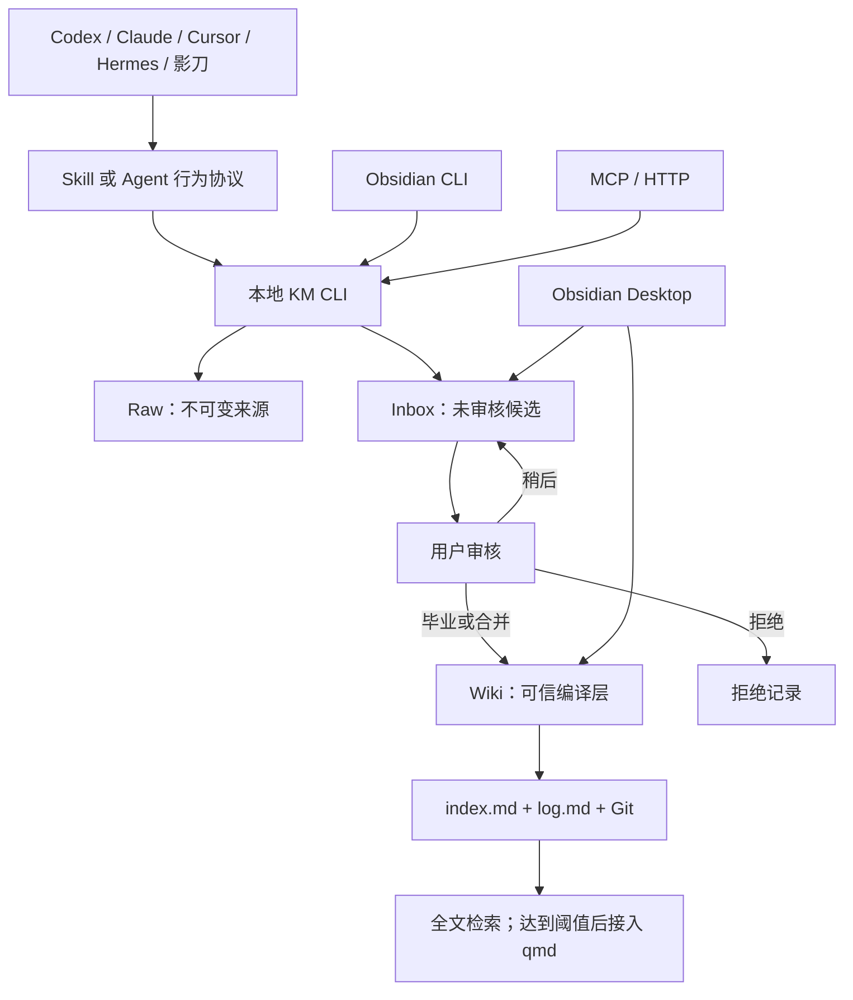

# AgentsKM 架构改造执行计划

> 版本：v2.0-draft  
> 日期：2026-07-25  
> 状态：待执行  
> 本文定位：AgentsKM 后续改造的唯一执行基线  
> 核心决策：本地 Markdown + Git + KM CLI 是内核；Obsidian 是 IDE；MCP、HTTP、Obsidian CLI 是适配层

---

## 一、改造目标

将 AgentsKM 建设为一个可以被 Codex、Claude Code、Cursor、HermesBot、影刀及其他 Agent 工具共同使用的本地 LLM Wiki，并满足以下目标：

1. **可积累**：聊天、资料和问题解决过程可以形成候选知识，并持续编译进 Wiki，而不是每次查询都重新总结。
2. **可审核**：Agent 可以自动捕获候选，但未经用户确认的内容不能直接成为正式知识。
3. **可移植**：即使 Obsidian、MCP 或某个 Agent 工具不可用，Markdown 知识库仍可完整读取、编辑和恢复。
4. **可追溯**：每次写入都能回答“谁、何时、基于什么来源、修改了什么”。
5. **可并发**：多个 Agent 同时工作时，不破坏文件、索引和日志的一致性。
6. **可维护**：能持续发现重复、冲突、过时、断链、孤儿页和未处理候选。
7. **可渐进扩展**：小规模阶段保持简单，只有在检索质量或规模达到阈值后才引入 qmd、MCP 服务或其他索引设施。

## 二、非目标

本轮改造不追求以下事项：

- 不保存所有聊天全文，不建设聊天归档中心。
- 不将数据库、向量库或 Obsidian 插件设为单一事实源。
- 不允许 Agent 在无来源、无审查的情况下自动改写正式 Wiki。
- 不在第一阶段建设复杂 Web 管理后台。
- 不为了“看起来智能”提前引入图数据库、知识图谱数据库或云端 RAG。
- 不把用户隐私、客户敏感数据、密钥、Token、账号信息沉淀到 Wiki。

## 三、目标架构



### 3.1 分层职责

| 层级 | 载体 | 职责 | 写入权限 |
|---|---|---|---|
| 原始来源层 | `raw/` | 保存网页、文档、日志、测试证据等原料 | 采集工具可新增，已有来源不可覆盖 |
| 候选层 | `000_Inbox/` | 保存 Agent 从聊天或资料中识别出的未审核知识 | 所有受信 Agent 可提交 |
| 可信知识层 | `wiki/` | 保存已审核、去重、建立链接的正式知识 | 仅编译者流程可写 |
| 规则层 | `purpose.md`、`SCHEMA.md` | 定义边界、格式、分类、质量门槛 | 用户确认后修改 |
| 导航审计层 | `index.md`、`log.md`、Git | 导航、演进历史、版本恢复 | 由 KM CLI 自动维护 |
| 检索缓存层 | `.km/cache/`、可选 qmd 索引 | 加速搜索，可随时重建 | 工具自动维护，不作为事实源 |
| 人工工作台 | Obsidian | 浏览、图谱、审核、人工修订 | 不承担系统唯一入口 |

### 3.2 工具定位

| 工具 | 决策 | 使用边界 |
|---|---|---|
| 本地文件系统 | 核心 | 所有知识最终落为普通 Markdown 文件 |
| Git | 核心 | 版本、差异、回滚、分支和审计 |
| KM CLI | 核心 | 校验、锁、候选、毕业、索引、日志、Lint |
| Agent Skill/规则文件 | 核心 | 判断什么值得捕获、如何总结、何时提醒 |
| Obsidian Desktop | 推荐 | 作为 Wiki IDE 和人工审核界面 |
| Obsidian 官方 CLI | 可选增强 | 反链、孤儿页、属性、历史、Bases 查询；不能成为唯一入口 |
| Obsidian Web Clipper | 可选增强 | 将网页转换为 Raw Markdown |
| Dataview/Bases | 可选增强 | 构建待审核和健康状态面板，不保存唯一状态 |
| Local REST API 插件 | 默认不启用 | 只有明确需要远程控制 Obsidian 时再使用 |
| MCP | 薄适配层 | 将 KM CLI 暴露给原生支持 MCP 的 Agent 工具 |
| HTTP | 薄适配层 | 为影刀等非 MCP 客户端提供本机接口 |
| qmd | 条件启用 | Wiki 达到规模或搜索质量触发阈值后使用 |

## 四、角色与权限

### 4.1 角色

1. **贡献者 Agent**
   - 可以搜索 Raw、Inbox 和 Wiki。
   - 可以提交候选。
   - 不能直接把候选毕业到 Wiki。
   - 不能修改 `purpose.md` 和 `SCHEMA.md`。

2. **编译者 Agent**
   - 在用户明确批准后执行去重、合并、建立链接和毕业。
   - 通过 KM CLI 原子更新 Wiki、Index 和 Log。
   - 不得自行扩大用户批准的变更范围。

3. **巡检者 Agent**
   - 只执行结构、链接、冲突、过时和来源检查。
   - 默认只生成报告，不自动修改正式知识。

4. **用户**
   - 决定正式知识的毕业、冲突仲裁、宪法级规则修改和敏感内容处理。

### 4.2 权限原则

- “自动捕获”只意味着可以自动进入 Inbox，不意味着可以自动进入 Wiki。
- 正式 Wiki 写入必须绑定一次明确审核决定，或者绑定用户提前批准的特定自动化规则。
- MCP、HTTP、Obsidian CLI 都不能绕过 KM CLI 的校验和权限规则。

## 五、建议目录结构

```text
AgentsKM/
├── 000_Inbox/                 # 未审核候选
├── raw/                       # 不可变来源
│   ├── articles/
│   ├── conversations/         # 可选；仅保存脱敏证据或引用，不默认保存全文
│   └── assets/
├── wiki/
│   ├── entities/
│   ├── concepts/
│   ├── comparisons/
│   ├── queries/
│   └── _archive/
├── docs/
│   ├── AgentsKM-架构改造执行计划.md
│   ├── agent-knowledge-protocol.md
│   ├── operations-runbook.md
│   └── adr/                    # 重要架构决策记录
├── tools/
│   └── km-cli/                 # 本地确定性内核
├── adapters/
│   ├── mcp/                    # MCP 薄包装
│   └── http/                   # 影刀等客户端的本机 HTTP 包装
├── tests/
│   ├── fixtures/
│   └── acceptance/
├── .km/
│   ├── locks/                  # 运行时文件锁，不提交 Git
│   ├── cache/                  # 可重建索引，不提交 Git
│   └── transactions/           # 未完成事务恢复信息，不提交 Git
├── purpose.md
├── SCHEMA.md
├── index.md
└── log.md
```

## 六、候选知识契约

所有聊天知识必须先形成 Inbox 候选。建议的 frontmatter：

```yaml
---
id: kmc-20260725-0001
title: 多 Agent 知识库的写入分权
created: 2026-07-25
updated: 2026-07-25
status: pending
type: concept
tags: [implicit-capture, agent, methodology]
agent_id: codex
source_tool: codex-desktop
source_session: session-id-or-reference
source_refs:
  - raw/articles/example.md
suggested_action: create
suggested_target: wiki/concepts/multi-agent-wiki-write-governance.md
value_reason: 可跨 Agent 工具复用，并影响正式知识写入安全
confidence: high
sensitivity: normal
fingerprint: sha256-of-normalized-topic-and-claims
---
```

### 6.1 状态机

```text
pending
  ├─> reminded
  │     ├─> approved ─> graduated | merged
  │     ├─> snoozed ─> reminded
  │     └─> rejected
  └─> duplicate ─> merged | rejected
```

### 6.2 状态规则

- `pending`：已捕获，尚未提醒。
- `reminded`：已向用户展示候选和建议动作。
- `approved`：用户明确同意毕业或合并。
- `snoozed`：暂缓处理，必须包含下次提醒时间或条件。
- `rejected`：不进入 Wiki，保留简短拒绝原因和指纹，避免重复提醒。
- `graduated`：已创建新的正式页面。
- `merged`：已合并到现有正式页面。
- `duplicate`：与已有候选或正式知识高度重复。

### 6.3 价值判断字段

Agent 在提交候选时至少说明：

- 为什么具有复用价值。
- 是新增知识还是对已有知识的修正。
- 证据来自哪里。
- 适用条件和不适用边界。
- 是否包含个人、客户、密钥或其他敏感信息。

### 6.4 提醒格式

```text
发现一条值得沉淀的知识：{候选标题}
价值：{value_reason}
建议：{新建页面 | 合并到现有页面}
目标：{suggested_target}
依据：{source_refs 或必要证据摘要}
请选择：沉淀 / 稍后 / 忽略
```

同一候选在内容未发生实质变化时不得重复提醒。

## 七、详细实施阶段

### 阶段 0：建立改造基线

**目标**：在任何迁移或自动写入前记录现状，避免覆盖用户已有内容。

#### 任务

- [ ] 将本文设为仓库内唯一有效的改造执行计划。
- [ ] 记录当前 Git 分支、最后提交和工作区状态。
- [ ] 将执行前已有的未提交文件列入保护清单，不覆盖、不回退。
- [ ] 清点 Raw、Inbox、Wiki、根目录页面和所有内部链接。
- [ ] 生成只读基线报告：文件数、页面数、断链数、孤儿页数、Inbox 数量。
- [ ] 明确所有迁移操作的源路径和目标路径。

#### 当前保护清单

执行本计划时必须保留并重新核对以下已有工作区内容：

- `index.md` 的现有未提交修改。
- `log.md` 的现有未提交修改。
- `000_Inbox/ai-agent-platform-comparison-2025.md` 的现有未跟踪内容。

#### 验收标准

- 基线报告可重复生成。
- 没有任何文件被删除、覆盖或移动。
- 所有后续阶段都有明确的输入、输出和回滚点。

### 阶段 1：目录和内容治理

**目标**：消除双轨目录和失效导航，形成唯一 Wiki 结构。

#### 任务

- [ ] 审核根目录 `concepts/` 与 `wiki/concepts/` 的重复职责。
- [ ] 将确认属于正式知识的根目录页面迁入 `wiki/` 对应分类。
- [ ] 迁移前搜索全部入站引用，生成路径变更清单。
- [ ] 将 Windows/WSL 绝对路径统一改成仓库相对链接或 `[[wikilinks]]`。
- [ ] 审核现有 Inbox，分别标记为：毕业、合并、保留待审、拒绝。
- [ ] 为毕业页补充来源、适用边界和至少两个有意义的出站链接。
- [ ] 重建 `index.md`，只列出正确位置的正式知识；Inbox 独立列为未审核候选。
- [ ] 将每次迁移和毕业动作追加到 `log.md`。
- [ ] 将完全被替代的正式页面移入 `wiki/_archive/`，不直接删除。

#### 验收标准

- 根目录不再存在与 `wiki/` 平行的正式知识分类。
- `index.md` 中所有链接均可解析。
- 正式 Wiki 页面不存在指向 `/mnt/d/...` 或个人机器绝对路径的内部引用。
- 每篇正式页面符合 SCHEMA 的 frontmatter、来源和链接要求。
- 迁移前后的内容可通过 Git 差异完整追踪。

### 阶段 2：统一 Schema 与候选流程

**目标**：让所有 Agent 对“候选、正式知识、来源和状态”使用同一契约。

#### 任务

- [ ] 在 `SCHEMA.md` 增加候选状态机和字段定义。
- [ ] 明确 `source_refs`、`agent_id`、`source_tool`、`source_session` 的格式。
- [ ] 明确聊天来源的证据规则：默认不保存全文，只保存脱敏摘录或稳定引用。
- [ ] 定义候选去重指纹算法。
- [ ] 定义新增页面、合并页面、冲突页面和拒绝候选的判定规则。
- [ ] 定义敏感信息扫描和拦截规则。
- [ ] 定义用户批准记录的保存方式。
- [ ] 编写 `docs/agent-knowledge-protocol.md`，作为所有 Agent 入口文件的共同来源。

#### 验收标准

- 任意 Agent 根据协议都能生成结构一致的候选文件。
- 未审核候选不能被正式检索结果伪装成可信知识。
- 相同主题被多个 Agent 重复提交时，可以识别并合并证据。
- 被拒绝的同一候选不会在无新证据时反复提醒。

### 阶段 3：建设本地 KM CLI 最小内核

**目标**：将必须可靠执行的机械纪律从提示词迁移到确定性工具。

#### 首批命令

```text
km status
km validate [path]
km propose --input <file-or-json>
km pending
km review <candidate-id> --action approve|reject|snooze
km promote <candidate-id> [--merge-into <wiki-page>]
km search <query> [--include-inbox]
km read <page>
km index rebuild
km lint
km log tail
```

#### 实现要求

- [ ] 所有命令支持人类可读输出和 `--json` 机器输出。
- [ ] 所有失败使用稳定退出码，并给出可行动的错误信息。
- [ ] 写操作使用仓库级或目标级文件锁。
- [ ] 写操作先写相邻临时文件，再使用原子替换。
- [ ] “页面写入 + Index 更新 + Log 追加”作为一个事务执行。
- [ ] 事务中断时保留恢复记录，下一次运行可检测并修复。
- [ ] 禁止通过 CLI 修改 `raw/` 中已有文件。
- [ ] 正式页面写入前强制校验 frontmatter、标签、来源和路径。
- [ ] 对危险覆盖操作默认拒绝，除非命令明确携带已批准的目标。
- [ ] `index.md` 可由 Wiki 全量重建，不能依赖人工维护结果。
- [ ] `log.md` 只追加，不重写历史。
- [ ] 对关键模块建立单元测试和临时仓库集成测试。

#### 建议模块

```text
km_cli/
├── cli.py
├── config.py
├── schema.py
├── validator.py
├── candidate.py
├── promoter.py
├── transaction.py
├── locking.py
├── indexer.py
├── search.py
├── lint.py
└── audit_log.py
```

#### 验收标准

- Obsidian 未启动时，全部核心命令仍可运行。
- 两个并发写入操作不会造成文件截断、Index 丢项或 Log 覆盖。
- 同一候选重复执行 `promote` 不会生成重复页面。
- 任一事务步骤失败后，仓库保持旧状态或能被明确恢复。
- 删除 `.km/cache/` 后可重新生成全部派生状态。

### 阶段 4：建立基础检索层

**目标**：在不提前引入向量数据库的前提下，为所有 Agent 提供统一搜索结果。

#### 任务

- [ ] `km search` 默认先搜索正式 Wiki，再按需搜索 Raw。
- [ ] Inbox 结果必须显式显示“未审核”。
- [ ] 使用标题、别名、标签、摘要和正文进行分层排序。
- [ ] 支持中英文关键词变体和文件名匹配。
- [ ] 结果返回路径、标题、类型、状态、摘要和匹配片段。
- [ ] 建立一组真实查询验收集，并记录期望命中页面。
- [ ] 记录查询日志，但不记录敏感查询全文。

#### 初始实现

- `index.md` 用于导航和快速上下文装载。
- `rg` 或等价本地全文搜索用于正文检索。
- 不建立不可恢复的专有索引。

#### 验收查询

- “领星 API 怎么鉴权”应命中对应认证知识。
- “WSL 如何连接 Windows Chrome CDP”应命中对应配置知识。
- 查询结果应区分正式 Wiki 与未审核 Inbox。
- 查询不应把 Raw 文档摘要误当成正式结论。

### 阶段 5：接入 Agent 行为协议

**目标**：让不同 Agent 使用同一知识判断流程，而不是复制多套规则。

#### 任务

- [ ] 建立统一行为协议 `docs/agent-knowledge-protocol.md`。
- [ ] 为 Codex 提供薄入口文件或仓库级 `AGENTS.md`。
- [ ] 为 Claude Code 提供薄入口文件或 `CLAUDE.md`。
- [ ] 为 Cursor、HermesBot 等工具提供只引用统一协议的适配说明。
- [ ] 各工具不得复制完整 Schema，避免规则漂移。
- [ ] Agent 开始任务时先搜索 Wiki，再解决问题。
- [ ] 对话中发现可复用知识时调用 `km propose`。
- [ ] 对话结束前只提醒真正达到价值门槛的候选。
- [ ] 用户批准后才由编译者调用 `km promote`。
- [ ] 对于无 CLI 能力的 Agent，先输出结构化候选，由适配器提交。

#### 价值触发条件

优先捕获：

- 多步骤技术问题的根因和验证过的解决方案。
- 可复用的架构决策、设计模式、SOP 和故障排查树。
- 对已有知识的纠正、版本变化或适用边界补充。
- 在未来任务中可以明显减少重复探索成本的内容。

不捕获：

- 一次性业务字段、客户私密信息、简单语法错误。
- 未经验证的猜测和纯粹闲聊。
- 已存在且没有新增证据或边界变化的重复结论。

#### 验收标准

- 至少两个不同 Agent 能生成格式一致的候选。
- 两个 Agent 提交相同主题时只形成一个待审核事项。
- Agent 能在回答中说明候选价值、建议目标和证据，而不是只问“要不要保存”。

### 阶段 6：接入 Obsidian 人工工作台

**目标**：让用户可以直观审核、浏览和巡检，同时保持 Obsidian 可替换。

#### 任务

- [ ] 将同一个仓库目录作为 Obsidian Vault 打开，不建立同步副本。
- [ ] 配置附件目录为 `raw/assets/`。
- [ ] 使用 Graph 检查枢纽页、孤儿页和异常链接密度。
- [ ] 使用 Bases 或 Dataview 建立待审核候选列表。
- [ ] 面板只读取 Markdown frontmatter，不保存唯一状态。
- [ ] 可选启用 Web Clipper，将网页写入 `raw/`。
- [ ] 可选启用官方 Obsidian CLI。
- [ ] 使用 CLI 的 `links`、`backlinks`、`unresolved`、`orphans`、`deadends` 辅助 Lint。
- [ ] 不默认安装 Local REST API；有明确远程控制需求时单独评估。

#### 验收标准

- 用户可以在 Obsidian 中看到 pending、snoozed、rejected 和 graduated 候选。
- 关闭 Obsidian 后，KM CLI 和 Agent 工作流不受影响。
- 移除 Dataview/Bases 面板不会丢失任何候选状态或正式知识。

### 阶段 7：建设 MCP 和 HTTP 薄适配层

**目标**：扩大工具兼容范围，但不复制 KM CLI 业务逻辑。

#### MCP 工具映射

```text
km_search              -> km search --json
km_read                -> km read --json
km_propose_capture     -> km propose --json
km_pending_reviews     -> km pending --json
km_review_candidate    -> km review --json
km_promote_candidate   -> km promote --json
km_lint                -> km lint --json
```

#### 实现要求

- [ ] MCP 使用 stdio 模式，由宿主按需启动。
- [ ] MCP 不直接操作 Markdown 文件，只调用 KM CLI 的公共接口。
- [ ] Agent 身份由适配层传入，并由 KM CLI 写入审计记录。
- [ ] 贡献者客户端不暴露 `promote` 工具，或由角色检查拒绝。
- [ ] HTTP 服务只绑定 `127.0.0.1`，默认不监听局域网。
- [ ] HTTP 写接口使用本机 Token，并对敏感参数进行日志脱敏。
- [ ] HTTP 与 MCP 使用同一命令契约和测试用例。
- [ ] 适配层故障不能损坏或锁死知识库。

#### 验收标准

- 原生终端、MCP 客户端和 HTTP 客户端搜索结果一致。
- 三种入口产生的候选使用相同 Schema 和去重逻辑。
- 非编译者客户端无法绕过审核直接写入 Wiki。
- 停止 MCP/HTTP 服务后，本地 CLI 仍可独立工作。

### 阶段 8：按阈值引入 qmd

**目标**：只有基础搜索无法满足需求时才增加语义检索，控制复杂度。

#### 启用条件

满足任一条件后进入评估：

- 正式 Wiki 达到约 500 页，或者 Raw 达到约 1,000 份来源。
- 验收查询集的 Top-5 命中率低于 90%。
- 同义表达、中文长问题或跨页面问题持续无法通过基础搜索命中。
- 用户明确需要自然语言语义检索和重排。

#### 任务

- [ ] 建立固定查询集，记录接入前的搜索基线。
- [ ] 将 qmd 索引视为可删除、可重建缓存。
- [ ] 评估 BM25、向量和混合检索的 Top-5 命中率。
- [ ] 默认只索引 Wiki；Raw 与 Inbox 使用独立集合或过滤字段。
- [ ] 证据摘录可展示，但避免让长证据块降低主题页面检索权重。
- [ ] `km search` 保持统一接口，在内部选择基础搜索或 qmd。
- [ ] 提供索引重建、版本检查和失败回退路径。

#### 验收标准

- qmd 不可用时自动回退到基础搜索。
- 删除 qmd 索引不会丢失知识。
- 新检索方案在固定查询集上有可测量提升，而不是只增加复杂度。

### 阶段 9：建立持续 Lint 和维护循环

**目标**：让 Wiki 不仅能增长，还能维持可信度和连接质量。

#### Lint 检查项

- [ ] Frontmatter 缺失或字段非法。
- [ ] 正式页面来源为空。
- [ ] 标签不在 Taxonomy 中。
- [ ] 内部链接无法解析。
- [ ] 孤儿页、无入链页和无出链页。
- [ ] Index 缺项、重复项或错误路径。
- [ ] 多个页面之间的冲突声明未处理。
- [ ] 超过约定期限仍未处理的 Inbox 候选。
- [ ] 页面超过拆分阈值。
- [ ] Raw 来源发生内容漂移。
- [ ] 页面包含疑似密钥、Token、邮箱、手机号或客户敏感字段。
- [ ] 已归档页面仍出现在主 Index。

#### 运行策略

- 每次正式写入后运行轻量校验。
- 每周或按需运行全库 Lint。
- 默认只生成报告，不自动修改知识。
- 可确定修复的机械问题允许通过明确命令批量修复。
- 矛盾、过时和分类调整必须进入用户审核。

#### 验收标准

- Lint 对同一仓库重复运行结果稳定。
- 报告能定位具体文件、规则和建议动作。
- Lint 失败不会修改正式 Wiki。

### 阶段 10：端到端验收与正式切换

**目标**：使用真实场景验证完整闭环，再宣布新流程成为默认流程。

#### 验收场景

1. **知识查询**
   - 新 Agent 首次进入仓库。
   - 搜索“领星 API 怎么鉴权”。
   - 一次命中正确正式页面并返回来源。

2. **聊天捕获**
   - 对话中解决一个新的多步骤问题。
   - Agent 自动生成候选并说明价值。
   - 用户选择“稍后”，候选进入 snoozed。
   - 到期后只提醒一次。

3. **毕业新建**
   - 用户批准候选。
   - 编译者创建正式页面。
   - Index 和 Log 同一事务更新。
   - 页面包含来源、边界和有意义的交叉链接。

4. **合并已有知识**
   - 候选与现有页面主题相同。
   - 系统建议合并而不是新建。
   - 合并后保留旧说法、新证据和更新时间。

5. **重复提交**
   - 两个 Agent 同时提交同一主题。
   - 只产生一个候选，来源和 Agent 身份均被保留。

6. **并发写入**
   - 两个不同正式写事务同时启动。
   - 文件、Index、Log 均保持一致，没有截断和覆盖。

7. **无 Obsidian 环境**
   - 完全关闭 Obsidian。
   - 搜索、候选、审核、毕业和 Lint 仍可完成。

8. **故障恢复**
   - 在事务中间模拟异常。
   - 再次运行能够回滚或完成恢复，不产生半成品页面。

#### 正式切换条件

- 所有核心验收场景通过。
- 现有 Inbox 已完成一次人工盘点。
- Wiki、Index 和 Log 一致。
- 至少两个 Agent 工具完成接入测试。
- 已建立回滚说明和操作手册。
- 用户确认新流程成为默认知识沉淀流程。

## 八、里程碑与优先级

| 里程碑 | 包含阶段 | 优先级 | 交付结果 |
|---|---|---|---|
| M1：内容基线 | 0-2 | P0 | 目录统一、候选契约、Schema 固化 |
| M2：本地闭环 | 3-4 | P0 | KM CLI、原子写入、统一搜索 |
| M3：多 Agent 接入 | 5-7 | P1 | Agent 协议、Obsidian 工作台、MCP/HTTP 适配 |
| M4：规模化维护 | 8-10 | P2 | qmd 条件接入、持续 Lint、端到端验收 |

### 推荐执行顺序

```text
M1 内容基线
→ M2 本地闭环
→ 先接入一个 Agent 试运行
→ M3 多 Agent 接入
→ 稳定运行一段时间
→ 按指标决定是否进入 M4
```

## 九、质量指标

改造完成后持续观察以下指标：

| 指标 | 目标 |
|---|---|
| 固定查询集 Top-5 命中率 | ≥ 90% |
| 正式页面来源完整率 | 100% |
| Index 链接可解析率 | 100% |
| 未经批准直接进入 Wiki 的候选 | 0 |
| 重复候选率 | < 5% |
| 正式 Wiki 孤儿页率 | < 5% |
| 半完成事务 | 0 |
| 敏感信息误沉淀 | 0 |
| Obsidian 关闭时核心流程可用率 | 100% |

## 十、风险与应对

| 风险 | 影响 | 应对措施 |
|---|---|---|
| Agent 过度捕获 | Inbox 变成垃圾场 | 价值门槛、去重指纹、拒绝记忆、摘要提醒 |
| Agent 漏捕获 | 有价值知识留在聊天中 | 对话中即时识别 + 会话结束补扫 |
| 多 Agent 并发冲突 | 文件或索引损坏 | 文件锁、事务、原子替换、幂等命令 |
| Wiki 出现无来源结论 | 信任下降 | 正式页面强制来源；决策与事实分型 |
| 插件或 Obsidian 不可用 | 自动化中断 | 本地 CLI 为核心，插件只做增强 |
| MCP 逻辑与本地逻辑漂移 | 不同客户端行为不一致 | MCP/HTTP 仅调用 KM CLI，不重复实现规则 |
| 搜索提前复杂化 | 维护成本上升 | 按规模和查询质量阈值启用 qmd |
| 完整聊天泄露隐私 | 安全风险 | 默认不存全文、脱敏扫描、最小证据原则 |
| Schema 频繁变化 | Agent 输出不一致 | Schema 版本化、迁移命令、薄入口引用统一协议 |
| Git 工作区已有修改被覆盖 | 用户工作丢失 | 启动基线、保护清单、分阶段提交、禁止破坏性回退 |

## 十一、回滚策略

- 每个里程碑独立提交，禁止将所有改造压成一次不可审查的大提交。
- 文件迁移使用 Git 可追踪的移动，并在 Log 中记录旧路径和新路径。
- 正式页面不直接删除；内容淘汰时进入 `wiki/_archive/`。
- KM CLI 上线初期保留“只验证、不写入”的 dry-run 模式。
- MCP、HTTP、Obsidian 插件和 qmd 均可独立关闭，不影响 Markdown 本体。
- `.km/cache/`、锁和检索索引均可删除重建。
- 事务失败优先回到变更前文件状态，不自动猜测如何完成未批准内容。
- 回滚不得使用会覆盖用户未提交工作的破坏性 Git 操作。

## 十二、执行前确认门

以下事项在进入对应阶段前需要用户确认：

1. 现有 Inbox 各页面是毕业、合并、保留还是拒绝。
2. 哪些 Agent 被授予编译者角色。
3. 是否启用聊天证据摘录；默认不保存完整聊天。
4. 是否安装可选 Obsidian 插件。
5. 是否开放本机 HTTP 适配器；默认只使用 CLI/MCP。
6. qmd 是否达到启用阈值；未达到则不安装。
7. M1、M2 完成后是否正式进入多 Agent 接入阶段。

## 十三、首轮执行清单

建议首轮只执行 P0 范围，形成最小可靠闭环：

- [ ] 完成阶段 0 的基线报告。
- [ ] 完成目录去双轨和内部链接修复。
- [ ] 人工审核现有 Inbox。
- [ ] 更新候选 Schema 和统一 Agent 协议。
- [ ] 实现 `km status`、`validate`、`propose`、`pending`、`promote`、`search`、`lint`。
- [ ] 完成原子写入、文件锁和幂等测试。
- [ ] 用一个 Agent 完成“发现 → 候选 → 提醒 → 批准 → Wiki”的真实试运行。
- [ ] 试运行稳定后，再开始 MCP、HTTP 和其他 Agent 接入。

---

## 最终架构原则

> Markdown 与 Git 提供地基；KM CLI 负责确定性纪律；Skill 负责知识判断；Obsidian 提供人的工作台；MCP 和 HTTP 负责连接不同 Agent；所有索引和插件都必须可替换、可重建、不可成为唯一事实源。
